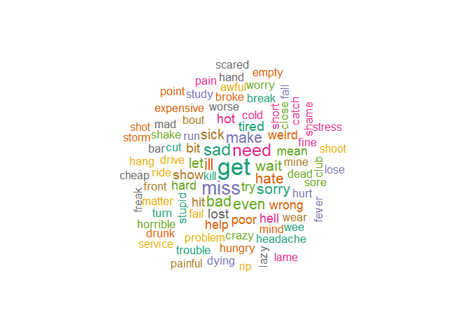

GGRC_final
================
Keyah
2023-12-01

Installing Packages

``` r
# install.packages("igraph")
# install.packages("wordcloud")
# install.packages("networkD3")
# install.packages("dplyr")
# install.packages("readtext")
# install.packages("plyr")
# install.packages("ggeasy")
# install.packages("qdap")
# install.packages("rJava")
# install.packages("caret")
# install.packages("ggpol")
# install.packages("SentimentAnalysis")
```

Loading libraries

``` r
library(SentimentAnalysis)
```

    ## Warning: package 'SentimentAnalysis' was built under R version 4.4.2

    ## 
    ## Attaching package: 'SentimentAnalysis'

    ## The following object is masked from 'package:base':
    ## 
    ##     write

``` r
library(tidytext)
```

    ## Warning: package 'tidytext' was built under R version 4.4.2

``` r
library(tm)
```

    ## Warning: package 'tm' was built under R version 4.4.2

    ## Loading required package: NLP

    ## Warning: package 'NLP' was built under R version 4.4.2

``` r
library(wordcloud)
```

    ## Warning: package 'wordcloud' was built under R version 4.4.2

    ## Loading required package: RColorBrewer

``` r
library(igraph)
```

    ## Warning: package 'igraph' was built under R version 4.4.2

    ## 
    ## Attaching package: 'igraph'

    ## The following objects are masked from 'package:stats':
    ## 
    ##     decompose, spectrum

    ## The following object is masked from 'package:base':
    ## 
    ##     union

``` r
library(glue)
library(stringr)
library(ggplot2)
```

    ## Warning: package 'ggplot2' was built under R version 4.4.2

    ## 
    ## Attaching package: 'ggplot2'

    ## The following object is masked from 'package:NLP':
    ## 
    ##     annotate

``` r
library(plyr)
```

    ## Warning: package 'plyr' was built under R version 4.4.2

``` r
library(dplyr)  
```

    ## Warning: package 'dplyr' was built under R version 4.4.2

    ## 
    ## Attaching package: 'dplyr'

    ## The following objects are masked from 'package:plyr':
    ## 
    ##     arrange, count, desc, failwith, id, mutate, rename, summarise,
    ##     summarize

    ## The following objects are masked from 'package:igraph':
    ## 
    ##     as_data_frame, groups, union

    ## The following objects are masked from 'package:stats':
    ## 
    ##     filter, lag

    ## The following objects are masked from 'package:base':
    ## 
    ##     intersect, setdiff, setequal, union

``` r
library(magrittr)
library(readtext)
```

    ## Warning: package 'readtext' was built under R version 4.4.2

``` r
library(stringr)
library(ggeasy)
```

    ## Warning: package 'ggeasy' was built under R version 4.4.2

``` r
library(rJava)
library(qdap)
```

    ## Warning: package 'qdap' was built under R version 4.4.2

    ## Loading required package: qdapDictionaries

    ## Loading required package: qdapRegex

    ## Warning: package 'qdapRegex' was built under R version 4.4.2

    ## 
    ## Attaching package: 'qdapRegex'

    ## The following object is masked from 'package:dplyr':
    ## 
    ##     explain

    ## The following object is masked from 'package:ggplot2':
    ## 
    ##     %+%

    ## Loading required package: qdapTools

    ## Warning: package 'qdapTools' was built under R version 4.4.2

    ## 
    ## Attaching package: 'qdapTools'

    ## The following object is masked from 'package:dplyr':
    ## 
    ##     id

    ## The following object is masked from 'package:plyr':
    ## 
    ##     id

    ## 
    ## Attaching package: 'qdap'

    ## The following object is masked from 'package:igraph':
    ## 
    ##     diversity

    ## The following objects are masked from 'package:tm':
    ## 
    ##     as.DocumentTermMatrix, as.TermDocumentMatrix

    ## The following object is masked from 'package:NLP':
    ## 
    ##     ngrams

    ## The following objects are masked from 'package:base':
    ## 
    ##     Filter, proportions

``` r
library(forcats)
library(ggpol)
```

    ## Warning: package 'ggpol' was built under R version 4.4.2

## Dataset

Setting Working Directory and reading the dataset

``` r
setwd("~/GGRC42/Sentiment Analysis")
```

This project involves sentiment analysis using a dataset comprising
3,534 tweets, randomly sampled from the Kaggle platform. The dataset is
attached for ease of reference and consists of the following variables:

textID: A unique identifier assigned to each tweet. text: The content of
the tweet, with each entry limited to a single sentence. sentiment: The
sentiment classification associated with each tweet (e.g., positive,
negative, or neutral). Time.Of.Tweet: The time of day when the tweet was
posted, categorized into three intervals—morning, afternoon, or evening.
Age of User: The age group of the user who authored the tweet,
represented in predefined categories.

This dataset provides a robust foundation for examining the relationship
between tweet content, sentiment, and user demographics, as well as
temporal patterns in posting behavior.

``` r
tweets <- read.csv("SA_tweets.csv")
attach(tweets)
```

## Data Cleaning

``` r
text <- str_replace_all(text,"[^[:graph:]]", " ")
clean.text = function(text)
  text = gsub("rt", "", text) #removing retweets
  text = gsub("@\\w+", "", text) 
  text = gsub("[[:punct:]]", "", text) #removing punctuation 
  text = gsub("[[:digit:]]", "", text) #removing digits
  text = gsub("http\\w+", "", text)
  text = gsub("[ |\t]{2,}", "", text)
  text = gsub("^ ", "", text)
  text = gsub(" $", "", text)
  text = gsub('https://','',text)
  text = gsub('http://','',text)
  text = gsub('[^[:graph:]]', ' ',text)
  text = gsub('[[:punct:]]', '', text)
  text = gsub('[[:cntrl:]]', '', text)
  text = gsub('\\d+', '', text)
  text = str_replace_all(text,"[^[:graph:]]", " ")
  text = tolower(text)
```

## EDA

To explore temporal patterns in the dataset, we created a visualization
showing the number of tweets posted during the morning, afternoon, and
evening. This allows us to identify the most active time of day for user
engagement on the platform.

``` r
time_labels = c("Morning","Night","Noon")
time_tweets <- table(Time.of.Tweet) 
barplot(time_tweets, names.arg = time_labels, width = 0.5 , col = "steelblue")
```

<!-- -->

As observed, the distribution of tweets across the different times of
day (morning, afternoon, and evening) is relatively balanced, with an
equal number of tweets posted during each time period. This uniformity
suggests that tweet activity is consistent throughout the day, without a
significant skew towards any particular time.

Similarly, plotting for number of tweets according to age:

``` r
age_labels = c("0-20","21-30","31-45","46-60","60-70","70-100")
age_tweets <- table(Age.of.User) 
barplot(age_tweets, names.arg = age_labels, lwd =2 , col = "steelblue")
```

<!-- -->

Similar to the distribution of tweets across different times of the day,
the dataset reveals an equal representation of tweets across all age
groups. This indicates a balanced involvement of users from each age
category, with no significant disparity in the number of tweets
contributed by each group.

## Using Dictionaries

To identify positive and negative sentiment within the tweets, we
utilized the Dictionary GI (General Inquirer), as other available
dictionaries were found to be biased or limited to financial
terminology. The Dictionary GI provides a more comprehensive and neutral
set of words for sentiment analysis.

For effective matching, the words from the Dictionary GI were converted
into vector representations. This allows for a more efficient comparison
and alignment between the sentiment words in the dictionary and the
words present in the tweets, ensuring a robust and unbiased sentiment
analysis.

``` r
PD_vector = unlist(DictionaryGI$positive) #converting2vector

ND_vector = unlist(DictionaryGI$negative) #converting2vector
```

#### Creating a function to analyze score for each setence

Score Analysis:

``` r
score.sentiment = function(text, PD_vector, ND_vector, .progress="none")
  require(plyr)
  require(stringr)

  scores = laply(text, function(text, PD_vector, ND_vector, .progress= "none") {

word.list = str_split(text, '\\s+') #splitting sentence into words
words = unlist(word.list) 

positive_score = match(words,PD_vector) #matching for positive words, gives index of words that are matched with positive words of GI Dictionary 

negative_score = match(words,ND_vector) #matching for negative words, gives index of words that are matched with negative words of GI Dictionary 

#Converting these into numeric form for binary values: 
positive_score = !is.na(positive_score)
negative_score = !is.na(negative_score)

score = sum(positive_score) - sum(negative_score)

  return(score)
}, PD_vector, ND_vector, .progress="none" )
  
#Creating a frequency table
table(scores)
```

    ## scores
    ##   -5   -4   -3   -2   -1    0    1    2    3    4    5    7 
    ##    4    7   38  162  593 1454  866  293   93   21    2    1

The table above displays the number of tweets for each sentiment score,
where a higher magnitude indicates a greater intensity of either
negative or positive emotion in a sentence. Specifically, a negative
score (–) corresponds to stronger negative emotions, while a positive
score (+) reflects stronger positive emotions. The magnitude of the
score denotes the extent to which a sentence contains more negative or
positive words, with higher magnitudes indicating a stronger emotional
tone in the respective direction.

``` r
#Creating Histogram of Sentiment scores
hist(scores, col = "steelblue", main = "Distribution of Sentiment scores of the tweets", xlab = "Sentiment Scores", ylab = "Frequency")
```

<!-- -->

The graphical representation of the table reveals that the majority of
tweets in our dataset are centered around a sentiment score of zero,
indicating that they are neutral in tone. This suggests that, overall,
the tweets exhibit a balanced emotional stance, with neither strong
positive nor negative sentiment prevailing.

``` r
positive <- length(which(scores> 0)) #calculating the number of positive tweets ie sentences with a score greater than 0 
negative <- length(which(scores< 0))
neutral <- length(which(scores== 0))
Sentiment <- c("Positive","Negative","Neutral")
Count <- c(positive,negative,neutral)
output <- data.frame(Sentiment,Count)
output$Sentiment<-factor(output$Sentiment,levels=Sentiment)

ggplot(output,aes(x = Sentiment,y=Count))+
  geom_bar(stat = "identity",fill = "steelblue", width = 0.5)+
  xlab("Sentiments")+
  ylab("Frequency")+
  theme_classic()
```

<!-- --> The
graph illustrates the distribution of tweets across different emotion
types. It is evident that the majority of the tweets are neutral in
sentiment, followed by a significant proportion of positive tweets.
Negative tweets are the least common, highlighting that negative
sentiment is less prevalent in the dataset compared to neutral or
positive emotions.

### Creating Wordclouds

Extracting positive and negative words from our tweets dataset to create
wordcloud and assess the commonly used words for each sentiment.

``` r
word.list = str_split(text, '\\s+')
words1 = unlist(word.list)


PS1 <- match(words1,PD_vector)
NS1 <- match(words1,ND_vector)

PS1 <- !is.na(PS1)
NS1 <- !is.na(NS1)

pos_words <- words1[which(PS1 == 1)]
neg_words <- words1[which(NS1 == 1)]
```

Wordcloud showing the top 90 positive words:

``` r
PW_corpus <- Corpus(VectorSource(pos_words))
PW_corpus <- tm_map(PW_corpus, content_transformer(tolower))
```

    ## Warning in tm_map.SimpleCorpus(PW_corpus, content_transformer(tolower)):
    ## transformation drops documents

``` r
PW_corpus <- tm_map(PW_corpus, function(x)removeWords(x,stopwords("english")))
```

    ## Warning in tm_map.SimpleCorpus(PW_corpus, function(x) removeWords(x,
    ## stopwords("english"))): transformation drops documents

``` r
pdm <- TermDocumentMatrix(PW_corpus)
pdm <- as.matrix(pdm)
pdm <- sort(rowSums(pdm), decreasing = TRUE)
pdm <- data.frame(word = names(pdm), freq = pdm)
set.seed(123)
wordcloud(PW_corpus, min.freq = 1, max.words = 90, scale = c(2.2,1),
          colors=brewer.pal(8, "Dark2"), random.color = T, random.order = F)
```

<!-- -->

Wordcloud showing the top 90 negative words:

``` r
NW_corpus <- Corpus(VectorSource(neg_words))
NW_corpus <- tm_map(NW_corpus, content_transformer(tolower))
```

    ## Warning in tm_map.SimpleCorpus(NW_corpus, content_transformer(tolower)):
    ## transformation drops documents

``` r
NW_corpus <- tm_map(NW_corpus, function(x)removeWords(x,stopwords("english")))
```

    ## Warning in tm_map.SimpleCorpus(NW_corpus, function(x) removeWords(x,
    ## stopwords("english"))): transformation drops documents

``` r
NW_corpus <- tm_map(NW_corpus, removeWords, c("fun","cool"))
```

    ## Warning in tm_map.SimpleCorpus(NW_corpus, removeWords, c("fun", "cool")):
    ## transformation drops documents

``` r
ndm <- TermDocumentMatrix(NW_corpus)
ndm <- as.matrix(ndm)
ndm <- sort(rowSums(ndm), decreasing = TRUE)
ndm <- data.frame(word = names(ndm), freq = ndm)
set.seed(123)
wordcloud(NW_corpus, min.freq = 1, max.words = 90, scale = c(2.2,1),
          colors=brewer.pal(8, "Dark2"), random.color = T, random.order = F)
```

<!-- -->

### Graphs of most frequent words

Most common positive words:

``` r
pos_words <- removeWords(pos_words, "just")
common_pos = freq_terms(pos_words, top=15)
ggplot(common_pos,aes(x = fct_reorder(WORD, FREQ, .desc=FALSE),y=FREQ))+
  geom_bar(stat = "identity",fill = "steelblue")+
  xlab("Word")+
  ylab("Frequency")+
  theme_classic()+
  coord_flip()
```

<!-- -->

Plotting the most common negative words

``` r
neg_words <- removeWords(neg_words, c("get" , "too", "even" , "make" , "cool"))
common_neg = freq_terms(neg_words, top=15)
ggplot(common_neg,aes(x = fct_reorder(WORD, FREQ, .desc=FALSE),y=FREQ))+
  geom_bar(stat = "identity",fill = "steelblue")+
  xlab("Word")+
  ylab("Frequency")+
  theme_classic()+
  coord_flip()
```

<!-- -->

## Assessing dictionary assignment

To assess the accuracy of the sentiment assignments, we compared the
predicted sentiments from our analysis with the observed sentiments
provided in the dataset. This comparison allows us to evaluate the
effectiveness of our sentiment classification method and identify any
discrepancies between the automatically assigned sentiment and the
ground truth labels.

``` r
scores1 <- vector()
n = length(scores)
for (i in 1:n) {          #calculating the scores in the form of -1,0 and 1 for                               each tweet 
  if (scores[i] > 0) {
    scores1[i] = 1}
  else if (scores[i] < 0){
    scores1[i] = -1}
  else {
    scores1[i] = 0}
}

results <- data.frame(actual = OBS, predicted = scores1) #Creating a data frame with observed vs predicted (calculated) scores
conf_matrix <- table(results$actual, results$predicted)
```

``` r
accuracy <- sum(diag(conf_matrix)) / sum(conf_matrix)
print(paste("Accuracy:", accuracy))
```

    ## [1] "Accuracy: 0.525466893039049"

``` r
precision <- diag(conf_matrix) / rowSums(conf_matrix)
print("Precision:")
```

    ## [1] "Precision:"

``` r
precision
```

    ##        -1         0         1 
    ## 0.4385614 0.5160839 0.6165005

The accuracy of our sentiment classification model is 52.5%, indicating
that approximately half of the tweets were correctly categorized. In
addition to overall accuracy, we also evaluated the precision for each
sentiment category. Precision represents the proportion of correctly
classified tweets within each sentiment type. The precision values for
each sentiment category are as follows:

Negative sentiment (-1): 0.4386 Neutral sentiment (0): 0.5161 Positive
sentiment (1): 0.6165 These values highlight that the model performs
relatively better in identifying positive tweets, with the lowest
precision observed for negative sentiment.

## Confusion Matrix

The confusion matrix provides a visual representation of the
discrepancies between the predicted sentiments (X-axis) and the observed
sentiments (Y-axis). It illustrates the variance between the model’s
sentiment classification and the actual sentiment labels provided in the
dataset. By examining the matrix, we can identify areas where the
model’s predictions are most accurate and where it may be misclassifying
certain sentiments.

``` r
print("Confusion Matrix:")
```

    ## [1] "Confusion Matrix:"

``` r
conf_matrix
```

    ##     
    ##       -1   0   1
    ##   -1 439 386 176
    ##   0  272 738 420
    ##   1   93 330 680

``` r
ggplot() +
  geom_confmat(aes(x=results$actual, y = results$predicted) , text.perc = TRUE, normalize = TRUE)
```

    ## Warning: Using the `size` aesthetic in this geom was deprecated in ggplot2 3.4.0.
    ## ℹ Please use `linewidth` in the `default_aes` field and elsewhere instead.
    ## This warning is displayed once every 8 hours.
    ## Call `lifecycle::last_lifecycle_warnings()` to see where this warning was
    ## generated.

<!-- -->

The high variance shows that the Dictionary GI might no longer be the
best at categorizing emotions, specially negative since 38.5% of
negative emotions were actually categorized as neutral. Around 30% of
positive emotions were also categorized as neutral. The bias might have
been created since Dictionary GI does not have a neutral category, words
that did not match positive or negative words were categorized as 0.

Hence, newer and better dictionaries with more words are required.

REFERENCES USED:

Chapter 33 Twitter sentiment analysis in R \| Spring 2021 EDAV Community
Contributions. (n.d.). Retrieved December 5, 2023, from
<https://jtr13.github.io/cc21/twitter-sentiment-analysis-in-r.html>

Package “SentimentAnalysis” Title Dictionary-Based Sentiment Analysis.
(2023). <https://github.com/sfeuerriegel/SentimentAnalysis/issues>
